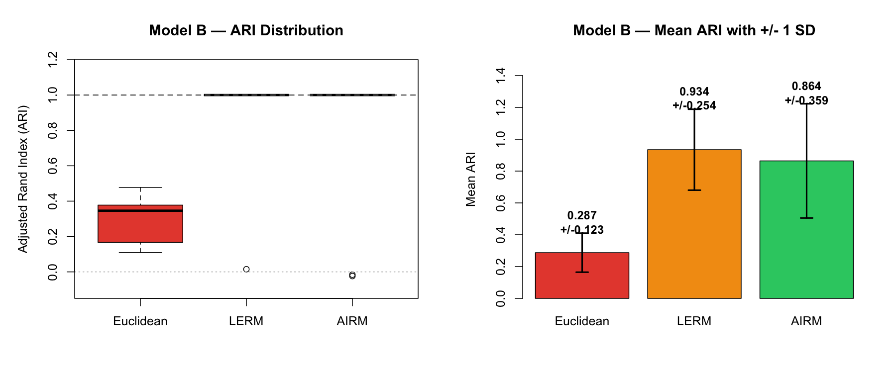
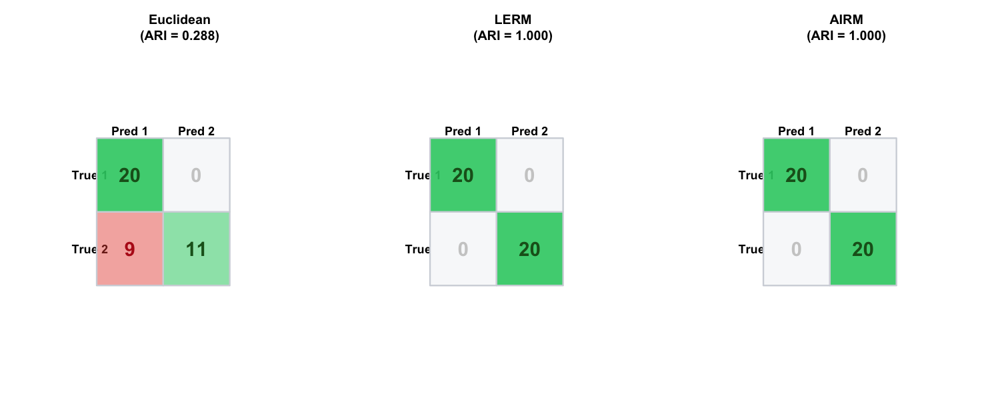
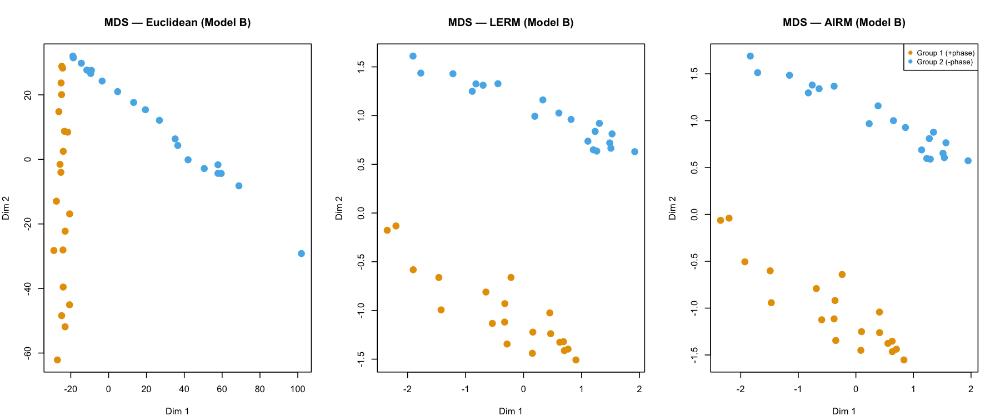
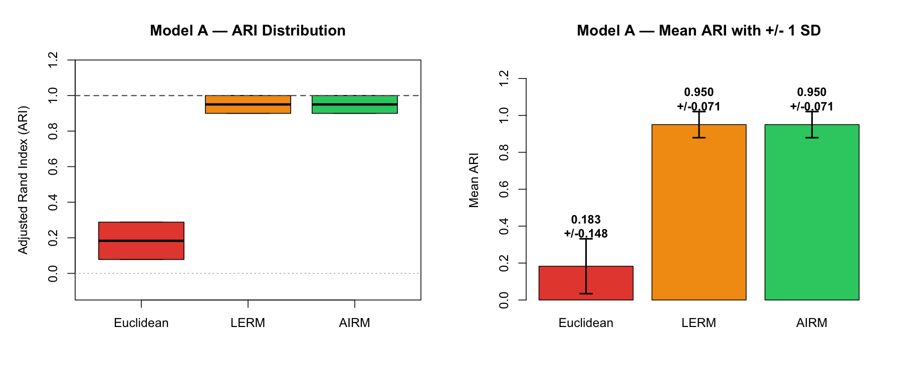
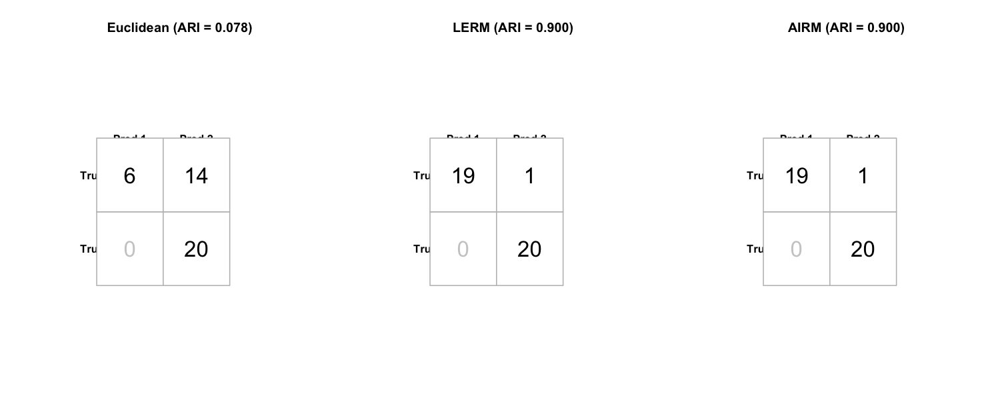
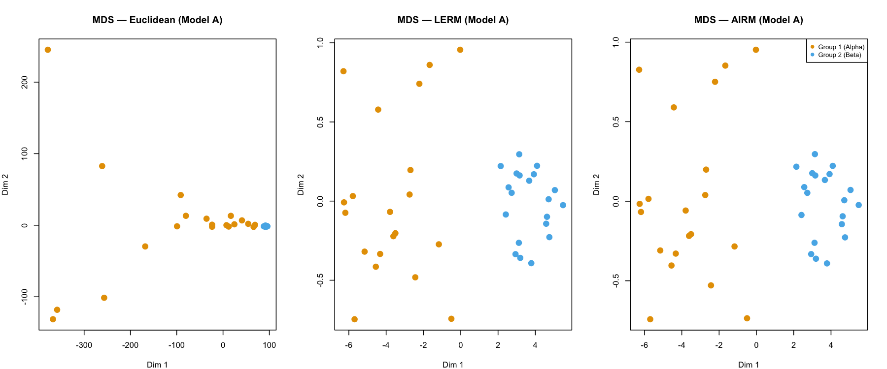
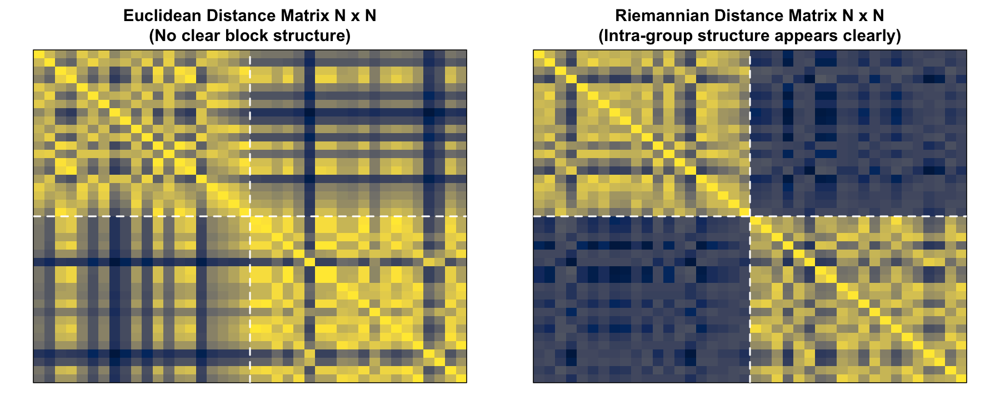
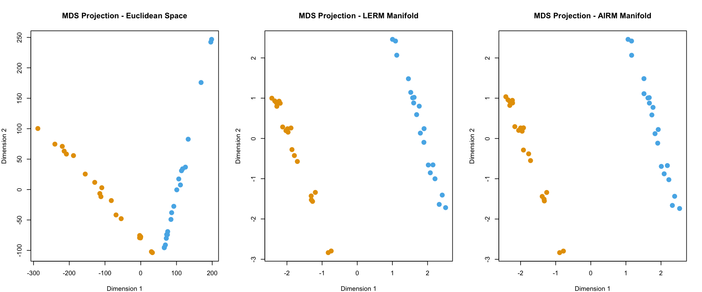
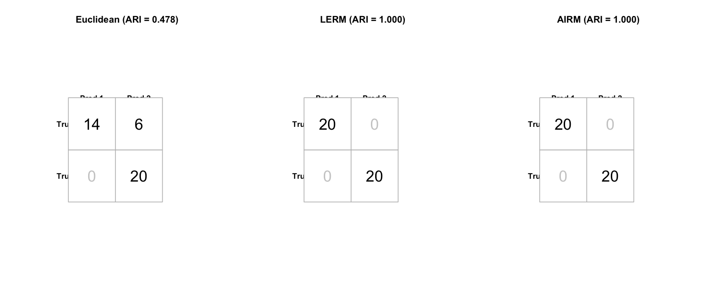

# Geometric Clustering of Complex HPD Matrices (EEG Connectivity Simulation)

This repository contains the complete R implementation of numerical simulations evaluating geometric constraints in clustering complex **Hermitian Positive Definite (HPD)** matrices (e.g., cross-spectral density matrices). 

In particular, it demonstrates the vulnerability of classical Euclidean distance metrics to global signal amplitude variance (the **random global amplitude scaling factor trap**) and validates the robust classification capabilities of **Log-Euclidean Riemannian Metrics (LERM)** and **Affine-Invariant Riemannian Metrics (AIRM)**.

## Project Description

Multivariate EEG signals are modeled as stochastic processes. When evaluating functional connectivity in the frequency domain, subjects are represented by complex HPD cross-spectral density matrices. This codebase replicates:
1. **Experiment 1 (Initial Validation)**: Phase-separated signal clustering under random scaling distortions.
2. **Experiment 2 (Sample Size)**: Impact of EEG signal length ($T$) on clustering quality.
3. **Experiment 3 (High Dimensionality)**: Scaling behavior as channel count ($d$) increases.
4. **Experiment 4 (Cohort Size)**: Impact of total subject count ($N$).
5. **Model A (Stochastic Brain State)**: Pure AR(2) process simulation (alpha vs. beta rhythm).
6. **Model B (Spatiotemporally Correlated Noise)**: Harmonic signal in bivariate VAR(2) correlated noise.

---

## Repository Structure

```text
├── hpd_clustering_simulation.R  # Main self-contained R script
├── README.md                     # Documentation and usage instructions
└── plots/                        # Generated diagnostic plots (PNG format)
```

---

## Dependencies

The code relies on the following standard R packages:
* **astsa**: Applied Statistical Time Series Analysis (for spectral estimation)
* **mclust**: Model-Based Clustering (for Adjusted Rand Index evaluation)
* **cluster**: Find Groups in Data (for clustering utilities)

The script will automatically detect and install any missing dependencies on first run.

---

## How to Run

You can execute the simulation directly from your terminal:

```bash
Rscript hpd_clustering_simulation.R
```

### Configurable Parameters
At the very top of `hpd_clustering_simulation.R`, you can edit the configuration:
```r
# Set to 15 for full replication (paper results); set to 2 for a fast test run.
N_MC_RUNS <- 15
```
Setting `N_MC_RUNS` to `2` allows you to test that the script runs end-to-end in under a minute. Setting it to `15` replicates the exact averages and standard deviations reported in the academic paper.

---

## Outputs

Upon execution, the script prints summary tables of Adjusted Rand Index (ARI), Accuracy (ACC), and execution times directly to the console. It also generates the following plots inside a local `plots/` folder:

* `exp1_signals.png`: Sample 3D EEG time series and smoothed periodograms for representative subjects.
* `exp1_heatmaps.png`: Visual comparison of Euclidean vs. Riemannian pairwise distance matrices ($N \times N$).
* `exp1_mds.png`: 2D Multidimensional Scaling (MDS) projection of Euclidean, LERM, and AIRM geometries.
* `exp1_ari_barplot.png`: ARI score comparison for the baseline experiment.
* `exp1_confusion_matrices.png`: Confusion matrices for the baseline experiment.
* `exp2_sample_size.png`: Mean ARI and Accuracy curves vs. signal length $T$.
* `exp3_dimension.png`: Mean ARI and Accuracy curves vs. channel count $d$.
* `exp4_cohort.png`: Mean ARI and Accuracy curves vs. cohort size $N$.
* `time_vs_sample_size.png` & `time_vs_dimension.png` & `time_vs_cohort.png`: Clustering computation time (s) comparison vs. signal length, channel count, and cohort size.
* `model_a_ari_plots.png` & `model_a_confusion_matrices.png` & `model_a_mds.png`: Robustness plots for Model A.
* `model_b_ari_plots.png` & `model_b_confusion_matrices.png` & `model_b_mds.png`: Robustness plots for Model B.

---

## Visual Results & Simulation Diagnosis

Here are the key diagnostic visualizations produced by the simulation suite.

### 1. Model B: Harmonic Signal + Spatiotemporally Correlated VAR(2) Noise
Under a challenging scaling factor of **0.37**, this experiment evaluates the performance of Euclidean vs. Log-Euclidean (LERM) and Affine-Invariant (AIRM) Riemannian metrics.

#### ARI Performance (Boxplot & Barplot)
The Log-Euclidean (LERM) and Affine-Invariant (AIRM) Riemannian metrics remain highly robust (Mean ARI $\approx 0.934$ and $0.864$), while the Euclidean metric fails (Mean ARI $\approx 0.287$).


#### Confusion Matrices (Representative Run)
A representative successful run (Run 1) displays the perfect separation obtained by the Riemannian metrics in contrast to the high error rate of the Euclidean metric.


#### 2D Manifold Visualization (MDS)
The multidimensional scaling projection illustrates the clean, distinct clusters captured by LERM and AIRM, whereas the Euclidean space shows massive overlap due to the random global amplitude scaling factor trap.


### 2. Model A: Pure Autoregressive AR(2) Process (Alpha vs. Beta Rhythm)
This simulation evaluates state classification under varying alpha/beta rhythmic components with scaling distortions.

#### ARI Performance


#### Confusion Matrices


#### 2D Manifold Visualization (MDS)


### 3. Experiment 1: Baseline Phase Separation under Scaling Distortions
This experiment demonstrates the fundamental geometric vulnerability of the Euclidean distance to signal amplitude variations.

#### Pairwise Distance Heatmaps ($N \times N$)
While the Euclidean distance matrix is dominated by scaling differences and shows no block structure, the Riemannian distance matrix naturally highlights the intra-group phase topology.


#### 2D Manifold Visualization (MDS)


#### Confusion Matrices


